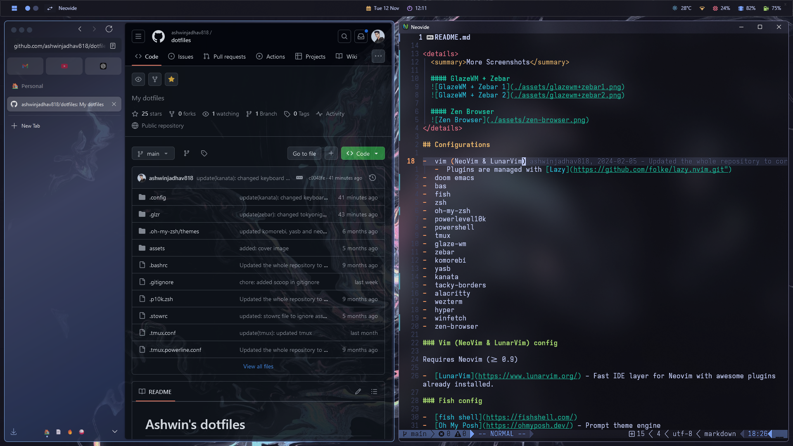

# Ashwin's dotfiles



## Configurations

-  vim (NeoVim & LunarVim)
   -  Plugins are managed with [Lazy](https://github.com/folke/lazy.nvim.git")
-  fish
-  zsh
-  powerlevel10k
-  powershel
-  tmux
-  glaze-wm
-  komorebi
-  yasb

### Vim (NeoVim & LunarVim) config

Requires Neovim (>= 0.9)

-  [LunarVim](https://www.lunarvim.org/) - Fast IDE layer for Neovim with awesome plugins already installed.

### Fish config

-  [fish shell](https://fishshell.com/)
-  [Oh My Posh](https://ohmyposh.dev/) - Prompt theme engine
-  [fisher](https://github.com/jorgebucaran/fisher/) - a plugin manager for Fish
-  [tide](https://github.com/IlanCosman/tide/) - the ultimate fish prompt
-  [nvm](https://github.com/jorgebucaran/nvm.fish/) - node package manager for fish
-  [z](https://github.com/jethrokuan/z/) - directory jumper

### Zsh config

-  [zsh shell](https://ohmyz.sh/)
-  [nerd font](https://www.nerdfonts.com/) - Powerline-patched fonts. I use Fira Code NF Retina and JetBrainsMono Nerd Font.
-  [z zsh plugin](https://github.com/agkozak/zsh-z) - Directory jumping
-  [exa](https://the.exa.website/) - `ls` replacement
-  [zsh-autosuggestions](https://github.com/zsh-users/zsh-autosuggestions) - Fish-like fast/unobtrusive autosuggestions for zsh.
-  [zsh-syntax-highlighting](https://github.com/zsh-users/zsh-syntax-highlighting) - Fish shell-like syntax highlighting for zsh.

### PowerShell config

-  [scoop](https://scoop.sh/) - A command-line installer
-  [git for windows](https://gitforwindows.org/)
-  [Oh My Posh](https://ohmyposh.dev/) - Prompt theme engine
-  [Terminal Icons](https://github.com/devblackops/Terminal-Icons) - Folder and file icons
-  [PSReadLine](https://docs.microsoft.com/en-us/powershell/module/psreadline/) - Cmdlets for customizing the editing environment, used for autocompletion
-  [z](https://www.powershellgallery.com/packages/z) - directory jumper


## Apps/utilites I use

-  [NeoVim](https://neovim.io)
-  [LunarVim](http://lunarvim.org)
-  [fish shell](https://fishshell.com)
-  powershell


## Steps to install

### Ubuntu

1. Clone this repository to your home directory.

```bash
# Using gh
gh repo clone ashwinjadhav818/dotfiles ~/.dotfiles

# ...or use HTTPS and switch remotes later.
git clone https://github.com/ashwinjadhav818/dotfiles.git ~/.dotfiles
```

2. Create symlinks in the Home directory to the real files in the repo.

```bash
stow .
```

3. Install LunarVim

```bash
bash <(curl -s https://raw.githubusercontent.com/lunarvim/lunarvim/master/utils/installer/install.sh)
```

### Windows

1. Clone this repository to your home directory.

```bash
# Using gh
gh repo clone ashwinjadhav818/dotfiles C:\Users\<UserName>\.dotfiles

# ...or use HTTPS and switch remotes later.
git clone https://github.com/ashwinjadhav818/dotfiles.git C:\Users\<UserName>\.dotfiles
```

2. Create symlinks in the Home directory to the real files in the repo.

```bash
sudo New-Item -Path $HOME\.config\powershell -ItemType SymbolicLink -Value $HOME\.dotfiles\.config\powershell\

sudo New-Item -Path $HOME\.config\komorebi -ItemType SymbolicLink -Value $HOME\.dotfiles\.config\komorebi\

sudo New-Item -Path $HOME\.config\whkdrc -ItemType SymbolicLink -Value $HOME\.dotfiles\.config\komorebi\whkdrc

sudo New-Item -Path $HOME\.config\yasb -ItemType SymbolicLink -Value $HOME\.dotfiles\.config\yasb\

sudo New-Item -Path $HOME\AppData\Local\nvim -ItemType SymbolicLink -Value $HOME\.dotfiles\.config\nvim\

sudo New-Item -Path $HOME\.config\starship.toml -ItemType SymbolicLink -Value $HOME\.dotfiles\.config\starhsip\starship.toml

sudo New-Item -Path $HOME\.bashrc -ItemType SymbolicLink -Value $HOME\.dotfiles\.bashrc

sudo New-Item -Path $HOME\.glaze-wm\config.yaml -ItemType SymbolicLink -Value $HOME\.dotfiles\glaze-wm\config.yaml

sudo New-Item -Path $Env:AppData\alacritty\alacritty.toml -ItemType SymbolicLink -Value $HOME\.dotfiles\.config\alacritty\alacritty.toml
```
