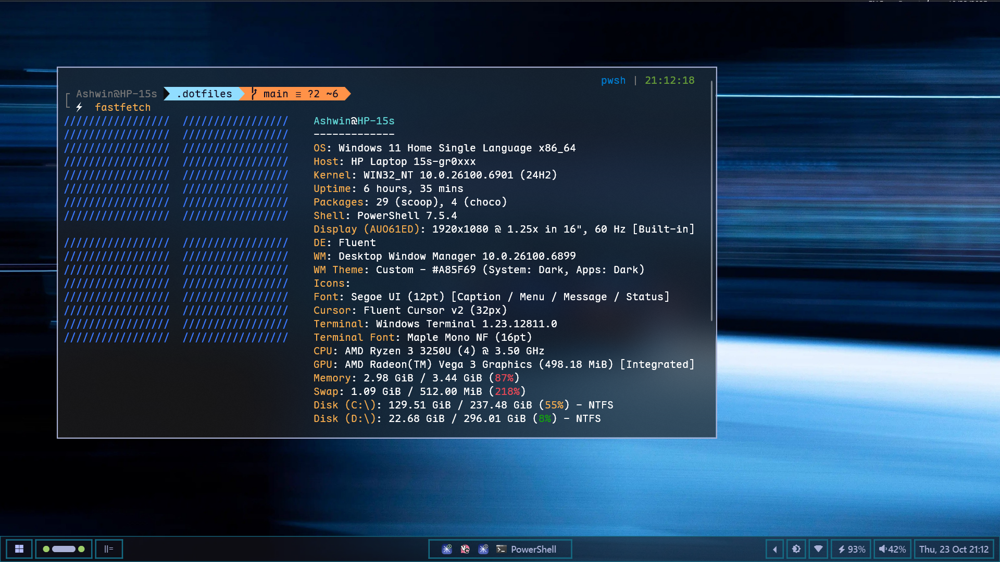
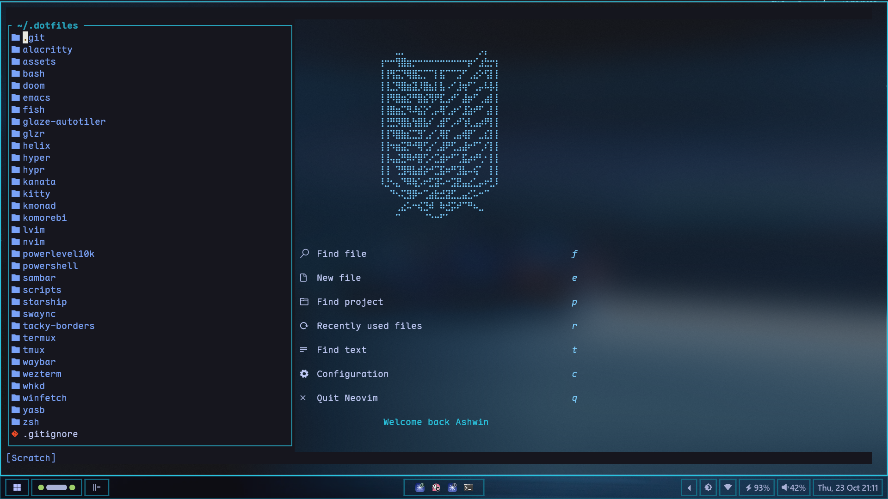
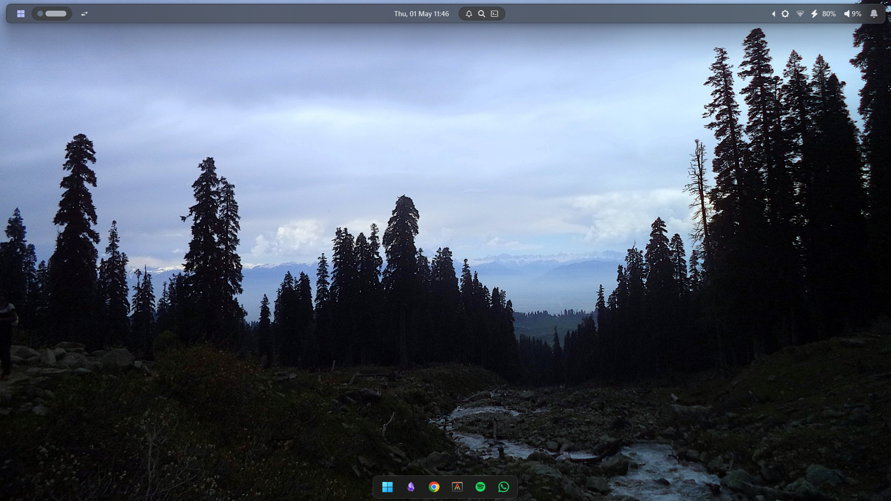
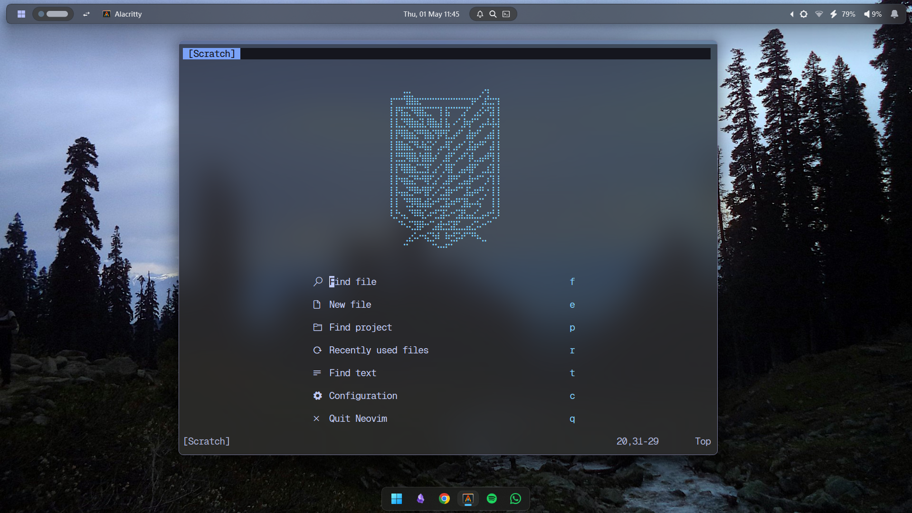
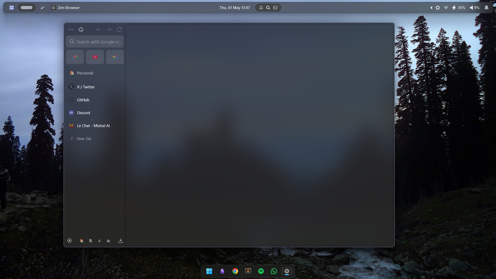
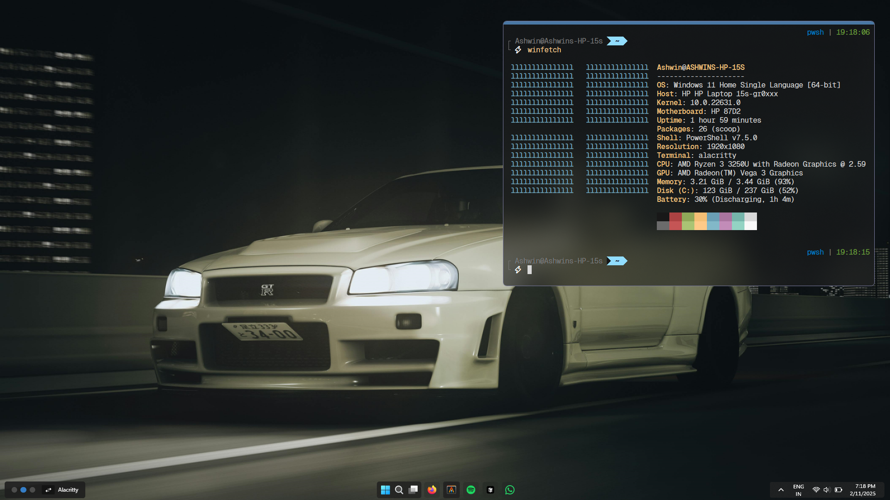
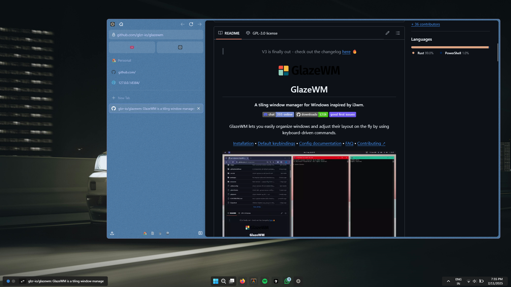

# Ashwin's dotfiles


<details>
  <summary>More Screenshots</summary>
  <details>
    <summary>Example 1</summary>
    


  </details>

  <details>
    <summary>Example 2</summary>
    



  </details>

  <details>
    <summary>Example 3</summary>
    



  </details>
</details>

## Configurations

- [vim](https://github.com/vim/vim/) ([NeoVim](https://github.com/neovim/neovim/) & [LunarVim](https://github.com/LunarVim/LunarVim/))
  - Plugins are managed with [Lazy](https://github.com/folke/lazy.nvim.git")
- [emacs](https://www.gnu.org/software/emacs/)
- [doom emacs](https://github.com/doomemacs/doomemacs)
- [helix](https://github.com/helix-editor/helix/)
- [bash](https://www.gnu.org/software/bash/)
- [fish](https://fishshell.com/)
- [zsh](https://www.zsh.org/)
- [oh-my-zsh](https://github.com/ohmyzsh/ohmyzsh/)
- [powerlevel10k](https://github.com/romkatv/powerlevel10k/)
- [powershell](https://learn.microsoft.com/en-us/powershell/)
- [tmux](https://github.com/tmux/tmux/)
- [glaze-wm](https://github.com/glzr-io/glazewm/)
- [zebar](https://github.com/glzr-io/zebar/)
- [komorebi](https://github.com/LGUG2Z/komorebi/)
- [yasb](https://github.com/amnweb/yasb/)
- [hypr](https://github.com/hyprwm/)
  - [hyprland](https://github.com/hyprwm/hyprland/)
  - [hyprlock](https://github.com/hyprwm/hyprlock/)
  - [hypridle](https://github.com/hyprwm/hypridle/)
  - [hyprpaper](https://github.com/hyprwm/hyprpaper/)
  - [hyprshade](https://github.com/loqusion/hyprshade/)
- [swaync](https://github.com/ErikReider/SwayNotificationCenter/)
- [waybar](https://github.com/Alexays/Waybar/)
- [kanata](https://github.com/jtroo/kanata/)
- [kmonad](https://github.com/kmonad/kmonad)
- [tacky-borders](https://github.com/lukeyou05/tacky-borders/)
- [kitty](https://github.com/kovidgoyal/kitty/)
- [alacritty](https://github.com/alacritty/alacritty/)
- [wezterm](https://github.com/wezterm/wezterm/)
- [hyper](https://github.com/vercel/hyper/)
- [winfetch](https://github.com/lptstr/winfetch/)
- [zen-browser](https://zen-browser.app/)

### Vim (NeoVim & LunarVim) config

Requires Neovim (>= 0.9)

- [LunarVim](https://www.lunarvim.org/) - Fast IDE layer for Neovim with awesome plugins already installed.

### Fish config

- [fish shell](https://fishshell.com/)
- [Oh My Posh](https://ohmyposh.dev/) - Prompt theme engine
- [fisher](https://github.com/jorgebucaran/fisher/) - a plugin manager for Fish
- [tide](https://github.com/IlanCosman/tide/) - the ultimate fish prompt
- [nvm](https://github.com/jorgebucaran/nvm.fish/) - node package manager for fish
- [zoxide](https://github.com/ajeetdsouza/zoxide) - directory jumper

### Zsh config

- [zsh shell](https://ohmyz.sh/)
- [nerd font](https://www.nerdfonts.com/) - Powerline-patched fonts.
- [zoxide](https://github.com/ajeetdsouza/zoxide) - Directory jumping
- [exa](https://the.exa.website/) - `ls` replacement
- [zsh-autosuggestions](https://github.com/zsh-users/zsh-autosuggestions) - Fish-like fast/unobtrusive autosuggestions for zsh.
- [zsh-syntax-highlighting](https://github.com/zsh-users/zsh-syntax-highlighting) - Fish shell-like syntax highlighting for zsh.

### PowerShell config

- [scoop](https://scoop.sh/) - A command-line installer
- [git for windows](https://gitforwindows.org/)
- [Oh My Posh](https://ohmyposh.dev/) - Prompt theme engine
- [Terminal Icons](https://github.com/devblackops/Terminal-Icons) - Folder and file icons
- [PSReadLine](https://docs.microsoft.com/en-us/powershell/module/psreadline/) - Cmdlets for customizing the editing environment, used for autocompletion
- [zoxide](https://github.com/ajeetdsouza/zoxide) - directory jumper

## Steps to install

### Linux

1. Clone this repository to your home directory.

```bash
# Using gh
gh repo clone ashwinjadhav818/dotfiles ~/.dotfiles

# ...or use HTTPS and switch remotes later.
git clone https://github.com/ashwinjadhav818/dotfiles.git ~/.dotfiles
```

2. Create symlinks in the Home directory to the real files in the repo.

```bash
stow .
```

### Windows

1. Clone this repository to your home directory.

```pwsh
# Using gh
gh repo clone ashwinjadhav818/dotfiles $HOME\.dotfiles

# ...or use HTTPS and switch remotes later.
git clone https://github.com/ashwinjadhav818/dotfiles.git $HOME\.dotfiles
```

2. Create symlinks in the Home directory to the real files in the repo.

```pwsh
cd $HOME/.dotfiles
./dotfiles.ps1
```
