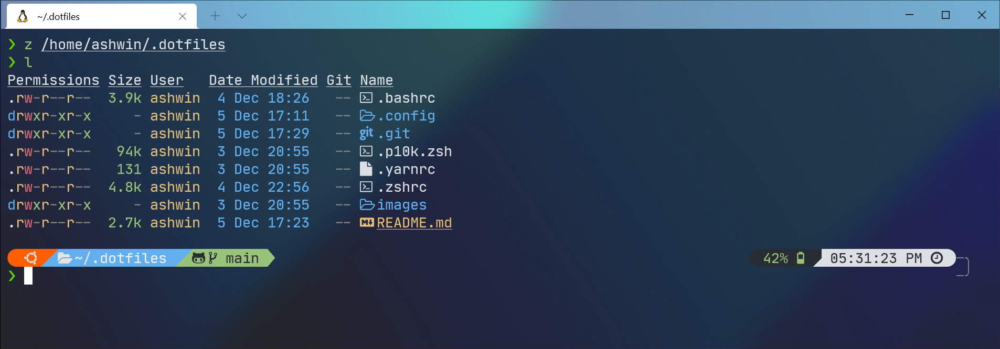

# My Ubuntu dotfiles



## Contents

- vim (NeoVim & LunarVim) config
  - Plugins are managed with [vim-plug](https://github.com/junegunn/vim-plug)
- zsh config
- powerlevel10k config
- yarn config

## Vim (NeoVim & LunarVim) Setup

Requires Neovim (>= 0.5)

- [vim-plug](https://github.com/junegunn/vim-plug) - A minimalist Vim plugin manager
- [nerdtree](https://github.com/preservim/nerdtree) - A file explorer
- [telescope.nvim](https://github.com/nvim-telescope/telescope.nvim) - A highly extendable fuzzy finder over lists
- [vim-airline](https://github.com/vim-airline/vim-airline) - Lean & mean status/tabline for vim that's light as air.
- [vim-commentary](https://github.com/tpope/vim-commentary) - A minimalist commenting system for vim.
- [vim-css-color](https://github.com/ap/vim-css-color) - A very fast, multi-syntax context-sensitive color name highlighter
- [awesome-vim-colorschemes](https://github.com/rafi/awesome-vim-colorschemes) - Collection of awesome color schemes for Vim, merged for quick use.
- [coc.nvim](https://github.com/neoclide/coc.nvim) - Make your Vim/Neovim as smart as VSCode.
- [vim-devicons](https://github.com/ryanoasis/vim-devicons) - Adds colorful icons to your vim plugins.

## Terminal Setup

- [Zsh shell](https://ohmyz.sh/)
- [Nerd Font](https://www.nerdfonts.com/) - Powerline-patched fonts. I use Fira Code NF Retina.
- [z zsh plugin](https://github.com/agkozak/zsh-z) - Directory jumping
- [Exa](https://the.exa.website/) - `ls` replacement
- [zsh-autosuggestions](https://github.com/zsh-users/zsh-autosuggestions) - Fish-like fast/unobtrusive autosuggestions for zsh.
- [zsh-syntax-highlighting](https://github.com/zsh-users/zsh-syntax-highlighting) - Fish shell-like syntax highlighting for zsh.

## Steps to installations it on Ubuntu:

> **_NOTE:_** Run all these commands from the home directory.

1. Clone this repository to your home directory

```zsh
# Using gh
gh repo clone AshAll-Rounder/My-Ubuntu-dotfiles ~/.dotfiles

# ...or use HTTPS and switch remotes later.
https://github.com/AshAll-Rounder/My-Ubuntu-dotfiles.git ~/.dotfiles
```

2. Create symlinks in the Home directory to the real files in the repo.

```zsh
# There are better and less manual ways to do this;
# investigate install scripts and bootstrapping tools.

ln -s ~/.dotfiles/.bashrc .bashrc
ln -s ~/.dotfiles/.zshrc ~/.zshrc
ln -s ~/.dotfiles/.p10k.zsh ~/.p10k.zsh
ln -s ~/.dotfiles/.config/nvim/init.vim ~/.config/nvim/init.vim

# Create a .config directory and inside it create nvim directory.
# NeoVim
mkdir ~/.config ~/.config/nvim
ln -s ~/.dofiles/.config/nvim/init.vim ~/.config/nvim/init.vim
ln -s ~/.dotfiles/.config/nvim/coc-settings.json ~/.config/nvim/coc-settings.json
ln -s ~/.dotfiles/.config/nvim/colors/NeoSolarized.vim ~/.config/nvim/colors/NeoSolarized.vim

# LunarVim
mkdir ~/.config ~/.config/lvim
ln -s ~/.dofiles/.config/lvim/config.lua ~/.config/lvim/config.lua
```
